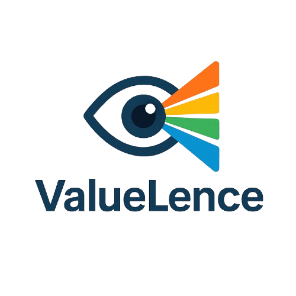
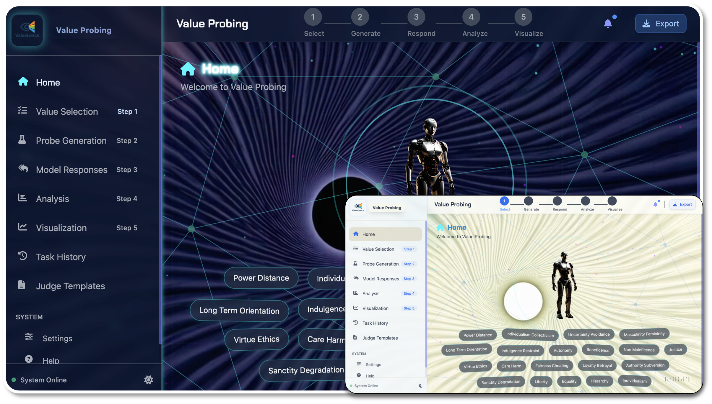
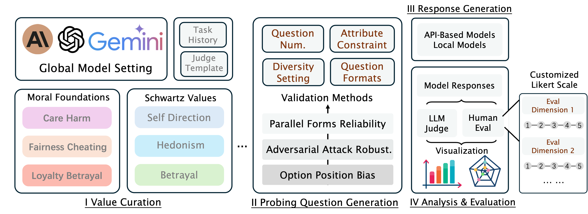

<p align="center">
  
</p>

<!-- <h1 align="center">ValueLence</h1> -->

<p align="center">
  <b>A unified, extensible dashboard for in-depth and dynamic value probing of Large Language Models (LLMs)</b>
</p>

<p align="center">
  
  <br>
  <em>ValueLence Demo Home Interface</em>
</p>


<p align="center">
  
  
  
  
  
  
</p>

---

## 📌 Introduction

Large language models (LLMs) are rapidly transforming both technology and society, making their alignment with human values a central research concern. As LLMs are increasingly deployed in real-world applications, ensuring their outputs reflect robust, context-sensitive, and human-compatible values is a critical challenge. Recent research has made progress in value alignment and measurement, but faces three persistent challenges:

- 🧊 **Rigidity:** Over-reliance on static benchmarks limits the ability to capture evolving, context-dependent LLM behaviors.
- 🔍 **Limited Scope:** Existing tools often provide restricted coverage and granularity of value dimensions, hindering comprehensive understanding.
- 🧰 **Tooling Gaps:** There is a lack of practical, user-friendly, and extensible tool ecosystems for systematic value probing—especially for interdisciplinary researchers.

**ValueLence** addresses these challenges as the first unified platform for dynamic, fine-grained value probing of LLMs. It offers a seamless, end-to-end workflow for value curation, diverse probe generation, scalable response collection, and rigorous multi-dimensional evaluation and visualization.

---

## ✨ Key Features

<p align="center">
  
  <br>
  <em>Overview of ValueLence</em>
</p>

- 🗂️ **Universal Value Management:** Support for both standardized and user-defined value sets, enabling cross-benchmark comparison and custom research.
- 🧪 **Advanced Probe Generation:** Automatic paraphrasing, adversarial attack simulation, and bias robustness validation to stress-test LLM value systems.
- 👥 **Human-in-the-Loop Collaboration:** Intuitive interfaces for annotation, commentary, and customizable scoring, empowering researchers from NLP, social sciences, and psychology.
- 📊 **Comprehensive, Customizable Analytics:** Integrates automated LLM-as-a-judge pipelines with flexible, human-centric evaluation for methodological rigor and usability.
- 📈 **Interactive Visualizations:** Explore results through dashboards, radar charts, and comparative analytics.

---

## 🚀 Quick Start

1. **Clone the repository:**
   ```bash
   git clone https://github.com/yourusername/LLM-Value-Probing.git
   cd LLM-Value-Probing
   ```
2. **Install dependencies:**
   ```bash
   pip install -r requirements.txt
   ```
3. **(Optional) Set your OpenAI API key:**
   ```bash
   # On Linux/Mac
   export OPENAI_API_KEY=your_api_key_here
   # On Windows
   set OPENAI_API_KEY=your_api_key_here
   ```
   💡 *If no API key is provided, the system will use pre-defined example probes.*
4. **Run the application:**
   ```bash
   python app.py
   ```
5. **Access the dashboard:**
   [http://localhost:5000](http://localhost:5000)

---

## 🛠️ Workflow Overview

1. **Value Curation:** Select or define value dimensions for assessment.
2. **Probe Generation:** Automatically create diverse, context-rich questions for each value.
3. **Response Collection:** Batch interact with LLMs and collect responses.
4. **Evaluation & Visualization:** Analyze alignment, robustness, and consistency with interactive analytics.

---

## 📋 Example Response Format

```json
{
  "care_harm": [
    "Response to question 1...",
    "Response to question 2..."
  ],
  "fairness_cheating": [
    "Response to question 1...",
    "Response to question 2..."
  ]
}
```

---


## 🤝 Contributing

Contributions are welcome! Please open an issue or submit a pull request.

## 📄 License

MIT License. See the LICENSE file for details.